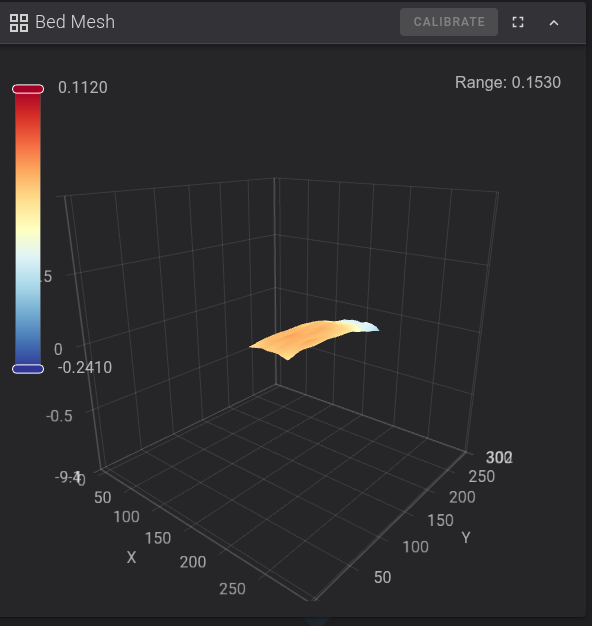

# K2Pro Adaptive Bed Mesh

## What it does
Automatically adapts the mesh area to the actual print zone, giving you a denser and more accurate mesh where it matters — without probing the entire bed every time.

The K2 Pro PRTouch implementation (`prtouch_v3_wrapper.py`) hardcodes 81 probe points (9x9). Changing PROBE_COUNT dynamically causes an `IndexError: list index out of range` crash. The probe count is therefore always 9x9, but the mesh boundaries adapt to the print area.

| Full bed 9x9 | Adaptive area 9x9 |
|---|---|
| 35mm spacing over 300x300mm | ~12mm spacing over 100x100mm |
| Same probe time | Same probe time |
| Coarse mesh everywhere | Dense mesh where you print |

A 10mm padding is added around the print area, clamped to bed limits (10-290mm).

## Why this instead of KAMP
- No `[exclude_object]` dependency
- No Moonraker plugin needed
- Falls back safely to full 9x9 if called without parameters
- Orca Slicer already provides `{first_layer_print_min}` / `{first_layer_print_max}` — no extra tooling required

## Context
- Printer: Creality K2 Pro
- Bed: Cryo Tack (PLA at 35°C bed / 220°C nozzle)
- PRTouch probe uses spiral pattern from center outward — only 9x9 is supported at runtime due to firmware hardcoding
- Bed has a natural dome shape (~0.65mm center-to-edge), well compensated by bicubic mesh
- Adaptive area mesh showed Range: 0.153mm vs 0.65mm for full bed — much more accurate for the print zone



## Installation
1. Copy the macro from `adaptive_bed_mesh.cfg` into your `macro.cfg`
2. In `START_PRINT`, replace `BED_MESH_PROFILE LOAD=default` — see `START_PRINT_change.txt`
3. In Orca Slicer → Printer Settings → Machine G-code → Machine start G-code, update the `START_PRINT` line — see `orca_start_gcode.txt`
4. Restart Klipper

## Verification
Check the Klipper console at print start — you should see a line like:
```
Adaptive mesh: 9x9 | area (122,109)-(178,290)
```

## Important note for K2 Pro users
The `gcode_macro.cfg` file on the K2 Pro starts with `START# F012` — this line must begin with `#` to be treated as a comment by Klipper's config parser. If you ever see:
```
File contains no section headers, line 1: 'START\n'
```
Fix it with:
```bash
sed -i '1s/^START/# START/' /mnt/UDISK/printer_data/config/gcode_macro.cfg
```
